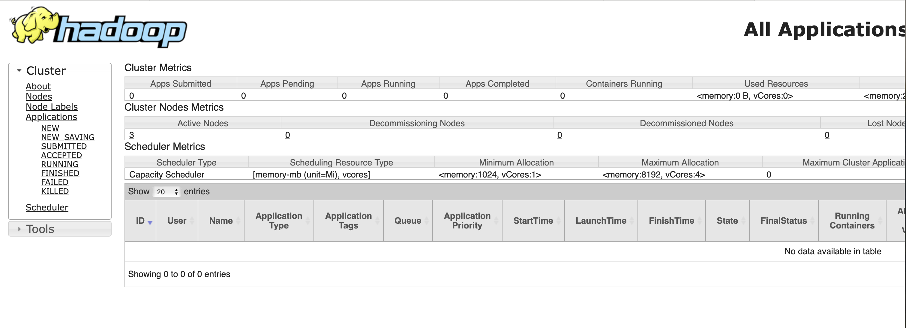

## Кулишенко Макар
### Построение пайплайнов данных. Домашнее задание 2


1. Как и в прошлый раз, войдем в среду и введем пароль:
```bash
ssh team@176.109.91.8
```
2. Так как мы хотим посмотреть на веб-интерфейс наших основных и вспомогательных демонов, нужно на jn через nginx указать адрес ноды nn, на которой он будет крутиться:
```bash
sudo vim /etc/nginx/sites-available/nn
```
```bash
server {
    listen 9870;
    root /var/www/html;
    index index.html index.htm index.nginx-debian.html;
    server_name _;
    location / {
        auth_basic "Administator's Area";
        auth_basic_user_file /etc/.htpasswd;
        proxy_pass http://tmpl-nn:9870;
} }
```

3. Настроим новый конфиг nginx
```bash
sudo ln -s /etc/nginx/sites-available/nn /etc/nginx/sites-enabled/
```
И перезапустим nginx
```bash
sudo systemctl restart nginx
```

4.  Откроем ssh-туннель. Выпрыгнем (надеюсь, оцените каламбур) с jn и повторно установим соединение по ssh (team@176.109.91.8  - это мой узел входа). У меня почему-то был занят порт, пришлось сначала убить процесс, а затем заново установить соединение.
```bash
exit
ssh -L 9870:127.0.0.1:9870 team@176.109.91.8 
```

5.  Проверим, что веб-интерфейс поднялся: с помощью браузера перейдем по ссылке: [localhost:9870/dfshealth.html](localhost:9870/dfshealth.html)

6. Установим yarn: cнова зайдем в терминал на jn под пользователем hadoop. Зайдем в папку:
```bash
sudo -i -u hadoop
cd hadoop-3.4.0/etc/hadoop/
```

7. Отредактируем конфиг `yarn-site.xml`. 
```bash
vim yarn-site.xml
```
Помещаем в тег `<configuration>` следующее:
```bash
<property>
    <name>yarn.nodemanager.aux-services</name>
    <value>mapreduce_shuffle</value>
</property>
<property>
    <name>yarn.nodemanager.env-whitelist</name>
    <value>JAVA_HOME,HADOOP_COMMON_HOME,HADOOP_HDFS_HOME,HADOOP_CONF_DIR,CLASSPATH_PREPEND_DISTCACHE,HADOOP_YARN_HOME,HADOOP_HDFS_HOME,HOME,PATH,LANG,TZ,HADOOP_MAPRED_HOME</value>
</property>
<property>
    <name>yarn.resourcemanager.hostname</name>
    <value>tmpl-nn</value>
</property>
<property>
    <name>yarn.resourcemanager.address</name>
    <value>tmpl-nn:8032</value>
</property>
<property>
    <name>yarn.resourcemanager.resource-tracker.address</name>
    <value>tmpl-nn:8031</value>
</property>
```
8. Поменяем еще один конфиг в этой же папке:
```bash
vim mapred-site.xml
```

В `<configuration>` необходимо поместить это:
```
<property>
    <name>mapreduce.framework.name</name>
    <value>yarn</value>
</property>
<property>
    <name>mapreduce.application.classpath</name>
    <value>$HADOOP_HOME/share/hadoop/mapreduce/*:$HADOOP_HOME/share/hadoop/mapreduce/lib/*</value>
</property>
```

9. Разнесем это на все наши ноды, созданные в прошлой домашке:
```bash
scp mapred-site.xml tmpl-dn-00:/home/hadoop/hadoop-3.4.0/etc/hadoop
scp mapred-site.xml tmpl-dn-01:/home/hadoop/hadoop-3.4.0/etc/hadoop
scp mapred-site.xml tmpl-nn:/home/hadoop/hadoop-3.4.0/etc/hadoop
scp yarn-site.xml tmpl-dn-00:/home/hadoop/hadoop-3.4.0/etc/hadoop
scp yarn-site.xml tmpl-dn-01:/home/hadoop/hadoop-3.4.0/etc/hadoop
scp yarn-site.xml tmpl-nn:/home/hadoop/hadoop-3.4.0/etc/hadoop
```

10. Теперь вернемся в namenode и запустим yarn
```bash
ssh tmpl-nn
hadoop-3.4.0/sbin/start-yarn.sh
```

11. Запустим historyserver
```bash
mapred --daemon start historyserver
```

12. Вернемся на jumpnode.
```bash
ssh tmpl-jn
```
Выполним команды:
```bash
sudo cp /etc/nginx/sites-available/nn /etc/nginx/sites-available/ya
sudo cp /etc/nginx/sites-available/nn /etc/nginx/sites-available/dh
```
13. Поправим их, указав нужные нам порты:
```bash
sudo vim /etc/nginx/sites-available/ya
```
Заменяем 9870 на 8088.

```bash
sudo vim /etc/nginx/sites-available/dh
```
Заменяем 9870 на 19888.

14. Сделаем наши конфигурации активными:
```bash
sudo ln -s /etc/nginx/sites-available/ya /etc/nginx/sites-enabled/ya
sudo ln -s /etc/nginx/sites-available/dh /etc/nginx/sites-enabled/dh
```

17. nginx перечитает конфиг:
```bash
sudo systemctl reload nginx
```

15. Пересоздадим сессию, пробросив еще 2 порта:
```bash
ssh -L 9870:127.0.0.1:9870 -L 8088:127.0.0.1:8088 -L 19888:127.0.0.1:19888 team@176.109.91.8
```

16. 
Теперь веб-интерфейсы основных и вспомогательных демонов кластера можно посмотреть на: http://localhost:8088


Спасибо, было интересно! 