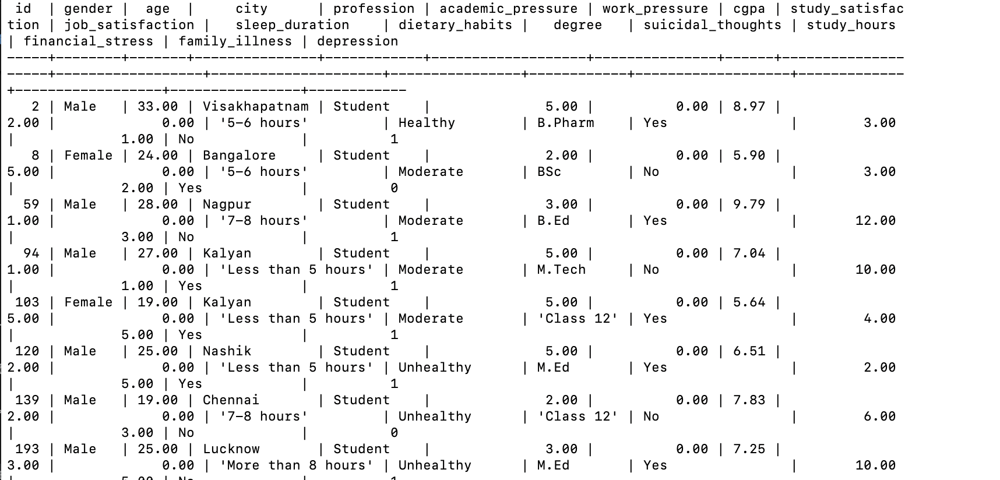

## Кулишенко Макар
### Построение пайплайнов данных. Домашнее задание 6

### Что надо сделать:
1. Улыбнуться, ведь на дворе весна
2. Подключиться к машине, где развернут GreenPlum (указано в задании)
3. Поработать с утилитой pyspark
Утилита psql уже предустановлена в системе
Psql - стандартный клиент для Postgres, который работает и с Green Plum

Если bash не видит утилиту psql, выполните команду source /usr/local/greenplum-db/greenplum_path.sh

Подключиться к конкретной базе данных:
psql -d idp

4. Прочитать файлы с помощью psql
- Загружаем файл на машину
- Запускаем gpfdist
- Создаем External table

### Само решение:

1. Зайдем на машину с Greenplum (пароль в тг-чате курса).
```bash
ssh user@91.185.85.179
```

2. Создадим папку для данных. Назову ее своим ФИ, чтобы можно было идентифицировать мою работу
```bash
mkdir makarkulishenko-data
```

3. Перейдем в папку 
```bash
cd makarkulishenko-data
```
Открою виртуальное окружение, поскольку скачиваю файл через gdown сл своего гугл-диска и скачаю датасет:

```bash
python3 -m venv venv
source venv/bin/activate
```
```python
pip install gdown
gdown --id 1m-WWg0TaF9DDXbxhHB09Ft8GmhieDlnA -O students.csv
```

Мой датасет - сокращенные данные о депрессивном расстройстве студентов по всему миру https://www.kaggle.com/datasets/adilshamim8/student-depression-dataset/data. Я немного поправил названия столбцов, чтобы они подходили под синтаксис sql

4. Выходим из виртуального окружения, переходим на jn и запускаем службу `gpfdist` на jumpnode:
```bash
cd ..
gpfdist -p 18911 -d ~/makarkulishenko-data/ &
```
Порт можно указать любой: главное чтобы он был свободный (я указал 18911).

5. Подключимся к БД сервиса:
```bash
psql -d idp
```

6. Создадим внешнюю таблицу для импортирования данных из CSV. Для моего датасета про депрессию у студентов таблица создается так:
```sql
CREATE EXTERNAL TABLE load_table_makarkulishenko (
    id bigint,
    Gender text,
    Age numeric(10, 2),
    City text,
    Profession text,
    Academic_Pressure numeric(10, 2),
    Work_Pressure  numeric(10, 2),
    CGPA  numeric(10, 2),
    Study_Satisfaction numeric(10, 2),
    Job_Satisfaction numeric(10, 2),
    Sleep_Duration text,
    Dietary_Habits text,
    Degree text,
    Suicidal_thoughts text,
    Study_Hours numeric(10, 2),
    Financial_Stress numeric(10, 2),
    Family_Illness text,
    Depression bigint
)
LOCATION ('gpfdist://91.185.85.179:18911/students.csv')
FORMAT 'CSV' (HEADER DELIMITER ',' QUOTE '"');
```
ВАЖНО! Здесь вместо 91.185.85.179 -- IP вашей Greenplum машины. Вместо 18911 -- порт, на котором вы создали службу в п. 4. Вместо students.csv -- название файла. Также желательно корректно прописать типы данных.

7. Создадим "чистую" таблицу, откуда будем переливать данные из временной таблицы:
```sql
CREATE TABLE IF NOT EXISTS table_makarkulishenko (
    id bigint,
    Gender text,
    Age numeric(10, 2),
    City text,
    Profession text,
    Academic_Pressure numeric(10, 2),
    Work_Pressure  numeric(10, 2),
    CGPA  numeric(10, 2),
    Study_Satisfaction numeric(10, 2),
    Job_Satisfaction numeric(10, 2),
    Sleep_Duration text,
    Dietary_Habits text,
    Degree text,
    Suicidal_thoughts text,
    Study_Hours numeric(10, 2),
    Financial_Stress numeric(10, 2),
    Family_Illness text,
    Depression bigint
) distributed by (id);
```

8. С помощью запроса перекачаем данные в новую таблицу:
```sql
INSERT INTO table_makarkulishenko SELECT * FROM load_table_makarkulishenko;
```

9. Убедимся, что все подгрузилось::
```sql
SELECT * FROM table_makarkulishenko LIMIT 10;



Ура! Все работает!

Спасибо за внимание!